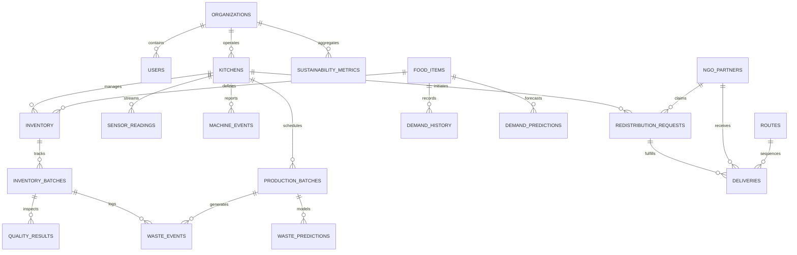

# reServe AI - Database Schema Specification
## Enterprise Relational Architecture (23 Core Entities)
**Database Engine**: PostgreSQL 15+ (with support for SQLite fallback in lightweight development)

---

## 1. Entity Relationship Overview



---

## 2. Relational Schema Definitions

### 2.1 Organizations & Identity
#### `organizations`
- `id` (UUID / Integer, Primary Key)
- `name` (VARCHAR(150), Unique, Not Null)
- `org_type` (ENUM: `'UNIVERSITY'`, `'CORPORATE_CAMPUS'`, `'HOSPITAL'`, `'FOOD_PROCESSOR'`, `'CENTRAL_KITCHEN'`)
- `contact_email` (VARCHAR(100), Not Null)
- `phone` (VARCHAR(25))
- `address` (TEXT)
- `latitude` (FLOAT)
- `longitude` (FLOAT)
- `is_active` (BOOLEAN, Default: `True`)
- `created_at` (TIMESTAMP WITH TIME ZONE, Default: `NOW()`)

#### `users`
- `id` (UUID / Integer, Primary Key)
- `organization_id` (FK -> `organizations.id`, Nullable for platform superadmins)
- `email` (VARCHAR(150), Unique, Not Null, Indexed)
- `hashed_password` (VARCHAR(255), Not Null)
- `full_name` (VARCHAR(120), Not Null)
- `role` (ENUM: `'SUPER_ADMIN'`, `'ORG_ADMIN'`, `'KITCHEN_MANAGER'`, `'QUALITY_INSPECTOR'`, `'LOGISTICS_COORDINATOR'`, `'NGO_REP'`)
- `phone_number` (VARCHAR(30))
- `is_active` (BOOLEAN, Default: `True`)
- `created_at` (TIMESTAMP WITH TIME ZONE, Default: `NOW()`)

---

### 2.2 Facility & Kitchen Infrastructure
#### `kitchens`
- `id` (UUID / Integer, Primary Key)
- `organization_id` (FK -> `organizations.id`, Not Null)
- `name` (VARCHAR(120), Not Null)
- `facility_code` (VARCHAR(50), Unique)
- `daily_meal_capacity` (INTEGER, Not Null)
- `kitchen_type` (ENUM: `'COMMISSARY'`, `'MESS_HALL'`, `'BAKERY'`, `'PROCESSING_UNIT'`)
- `latitude` (FLOAT, Not Null)
- `longitude` (FLOAT, Not Null)
- `created_at` (TIMESTAMP WITH TIME ZONE, Default: `NOW()`)

---

### 2.3 Master Catalog & Inventory Management
#### `food_items`
- `id` (UUID / Integer, Primary Key)
- `name` (VARCHAR(120), Not Null, Indexed)
- `category` (ENUM: `'GRAINS'`, `'VEGETABLES'`, `'DAIRY'`, `'FRUITS'`, `'MEAT_POULTRY'`, `'COOKED_MEALS'`, `'BAKERY'`)
- `perishable_type` (ENUM: `'HIGHLY_PERISHABLE'`, `'SEMI_PERISHABLE'`, `'NON_PERISHABLE'`)
- `default_shelf_life_hours` (INTEGER, Not Null)
- `carbon_footprint_per_kg` (FLOAT, Default: 2.5) -- Poore & Nemecek coefficient
- `water_footprint_per_kg` (FLOAT, Default: 500.0) -- Liters / kg

#### `inventory`
- `id` (UUID / Integer, Primary Key)
- `kitchen_id` (FK -> `kitchens.id`, Not Null)
- `food_item_id` (FK -> `food_items.id`, Not Null)
- `current_quantity_kg` (FLOAT, Default: 0.0)
- `reorder_threshold_kg` (FLOAT, Default: 10.0)
- `storage_location` (VARCHAR(80)) -- e.g. "Cold Storage Room A"
- `last_audited_at` (TIMESTAMP WITH TIME ZONE)

#### `inventory_batches`
- `id` (UUID / Integer, Primary Key)
- `inventory_id` (FK -> `inventory.id`, Not Null)
- `batch_number` (VARCHAR(60), Unique, Not Null)
- `initial_quantity_kg` (FLOAT, Not Null)
- `remaining_quantity_kg` (FLOAT, Not Null)
- `procured_at` (TIMESTAMP WITH TIME ZONE, Default: `NOW()`)
- `expiry_date` (TIMESTAMP WITH TIME ZONE, Not Null, Indexed)
- `status` (ENUM: `'OPTIMAL'`, `'NEARING_EXPIRY'`, `'EXPIRED'`, `'DEPLETED'`, `'REDISTRIBUTED'`)

---

### 2.4 Production & Demand Intelligence
#### `production_batches`
- `id` (UUID / Integer, Primary Key)
- `kitchen_id` (FK -> `kitchens.id`, Not Null)
- `food_item_id` (FK -> `food_items.id`, Not Null)
- `planned_quantity_kg` (FLOAT, Not Null)
- `actual_produced_kg` (FLOAT)
- `surplus_quantity_kg` (FLOAT, Default: 0.0)
- `meal_slot` (ENUM: `'BREAKFAST'`, `'LUNCH'`, `'DINNER'`, `'MIDNIGHT_SNACK'`)
- `scheduled_for` (DATE, Not Null)
- `status` (ENUM: `'SCHEDULED'`, `'IN_PREPARATION'`, `'COMPLETED'`, `'SURPLUS_FLAGGED'`)

#### `demand_history`
- `id` (UUID / Integer, Primary Key)
- `kitchen_id` (FK -> `kitchens.id`, Not Null)
- `food_item_id` (FK -> `food_items.id`, Not Null)
- `date` (DATE, Not Null)
- `meal_slot` (VARCHAR(30), Not Null)
- `orders_count` (INTEGER, Not Null)
- `actual_consumption_kg` (FLOAT, Not Null)
- `footfall` (INTEGER)
- `is_holiday` (BOOLEAN, Default: `False`)
- `weather_condition` (VARCHAR(50))

#### `demand_predictions`
- `id` (UUID / Integer, Primary Key)
- `kitchen_id` (FK -> `kitchens.id`, Not Null)
- `food_item_id` (FK -> `food_items.id`, Not Null)
- `prediction_date` (DATE, Not Null)
- `meal_slot` (VARCHAR(30), Not Null)
- `expected_demand_kg` (FLOAT, Not Null)
- `confidence_score` (FLOAT, Not Null) -- e.g. 0.94
- `recommended_production_kg` (FLOAT, Not Null)
- `surplus_risk_probability` (FLOAT, Not Null)
- `model_version` (VARCHAR(50), Default: `'lgbm-v1.4'`)
- `generated_at` (TIMESTAMP WITH TIME ZONE, Default: `NOW()`)

---

### 2.5 Waste Tracking & Predictions
#### `waste_events`
- `id` (UUID / Integer, Primary Key)
- `kitchen_id` (FK -> `kitchens.id`, Not Null)
- `food_item_id` (FK -> `food_items.id`, Not Null)
- `batch_id` (FK -> `inventory_batches.id`, Nullable)
- `production_id` (FK -> `production_batches.id`, Nullable)
- `quantity_wasted_kg` (FLOAT, Not Null)
- `waste_stage` (ENUM: `'STORAGE_EXPIRY'`, `'PREP_TRIMMING'`, `'OVERPRODUCTION'`, `'PLATE_LEFTOVER'`, `'EQUIPMENT_FAILURE'`)
- `primary_cause` (VARCHAR(200), Not Null)
- `financial_loss_inr` (FLOAT, Not Null)
- `logged_at` (TIMESTAMP WITH TIME ZONE, Default: `NOW()`)

#### `waste_predictions`
- `id` (UUID / Integer, Primary Key)
- `kitchen_id` (FK -> `kitchens.id`, Not Null)
- `forecast_date` (DATE, Not Null)
- `expected_waste_kg` (FLOAT, Not Null)
- `waste_probability` (FLOAT, Not Null)
- `predicted_root_cause` (VARCHAR(150))
- `prevention_recommendation` (TEXT)
- `generated_at` (TIMESTAMP WITH TIME ZONE, Default: `NOW()`)

---

### 2.6 Computer Vision Quality & Freshness
#### `quality_results`
- `id` (UUID / Integer, Primary Key)
- `batch_id` (FK -> `inventory_batches.id`, Nullable)
- `food_item_id` (FK -> `food_items.id`, Not Null)
- `image_url` (VARCHAR(300), Not Null)
- `freshness_level` (ENUM: `'FRESH'`, `'MODERATE'`, `'DEGRADING'`, `'ROTTEN'`)
- `freshness_score` (FLOAT, Not Null) -- 0.0 to 100.0
- `remaining_shelf_life_days` (FLOAT, Not Null)
- `redistribution_status` (ENUM: `'SAFE_FOR_REDISTRIBUTION'`, `'PROCESS_IMMEDIATELY'`, `'COMPOST_ONLY'`, `'HAZARD_DISCARD'`)
- `confidence` (FLOAT, Not Null)
- `scanned_by` (FK -> `users.id`, Nullable)
- `created_at` (TIMESTAMP WITH TIME ZONE, Default: `NOW()`)

---

### 2.7 IoT Sensors & Environmental Monitoring
#### `sensor_readings`
- `id` (UUID / Integer, Primary Key)
- `kitchen_id` (FK -> `kitchens.id`, Not Null)
- `sensor_id` (VARCHAR(50), Not Null, Indexed)
- `sensor_type` (ENUM: `'TEMPERATURE'`, `'HUMIDITY'`, `'GAS_METHANE'`, `'AMMONIA'`, `'DOOR_OPEN'`))
- `value` (FLOAT, Not Null)
- `unit` (VARCHAR(20), Not Null) -- e.g. "°C", "%RH", "PPM"
- `storage_zone` (VARCHAR(60), Not Null) -- e.g. "Walk-in Freezer 01"
- `is_threshold_breached` (BOOLEAN, Default: `False`)
- `timestamp` (TIMESTAMP WITH TIME ZONE, Default: `NOW()`, Indexed)

#### `energy_consumption`
- `id` (UUID / Integer, Primary Key)
- `kitchen_id` (FK -> `kitchens.id`, Not Null)
- `device_name` (VARCHAR(80))
- `power_kwh` (FLOAT, Not Null)
- `cost_inr` (FLOAT, Not Null)
- `timestamp` (TIMESTAMP WITH TIME ZONE, Default: `NOW()`)

#### `water_consumption`
- `id` (UUID / Integer, Primary Key)
- `kitchen_id` (FK -> `kitchens.id`, Not Null)
- `flow_liters` (FLOAT, Not Null)
- `usage_category` (ENUM: `'DISHWASHING'`, `'FOOD_PREP'`, `'CLEANING'`, `'GENERAL'`)
- `timestamp` (TIMESTAMP WITH TIME ZONE, Default: `NOW()`)

#### `machine_events`
- `id` (UUID / Integer, Primary Key)
- `kitchen_id` (FK -> `kitchens.id`, Not Null)
- `machine_id` (VARCHAR(50), Not Null)
- `machine_type` (ENUM: `'BLAST_CHILLER'`, `'STEAM_BOILER'`, `'CONVECTION_OVEN'`, `'REFRIGERATION_COMPRESSOR'`)
- `rotational_speed_rpm` (FLOAT)
- `torque_nm` (FLOAT)
- `tool_wear_min` (FLOAT)
- `air_temp_k` (FLOAT)
- `process_temp_k` (FLOAT)
- `failure_probability` (FLOAT, Default: 0.0)
- `failure_type` (VARCHAR(80)) -- e.g. "Heat Dissipation Failure", "None"
- `status` (ENUM: `'HEALTHY'`, `'MAINTENANCE_REQUIRED'`, `'CRITICAL_SHUTDOWN'`)
- `created_at` (TIMESTAMP WITH TIME ZONE, Default: `NOW()`)

---

### 2.8 Redistribution Network & Smart Logistics
#### `ngo_partners`
- `id` (UUID / Integer, Primary Key)
- `name` (VARCHAR(150), Not Null)
- `registration_number` (VARCHAR(80), Unique)
- `contact_person` (VARCHAR(100))
- `phone` (VARCHAR(30), Not Null)
- `email` (VARCHAR(100), Not Null)
- `address` (TEXT, Not Null)
- `latitude` (FLOAT, Not Null)
- `longitude` (FLOAT, Not Null)
- `daily_meal_capacity` (INTEGER, Not Null)
- `has_cold_storage` (BOOLEAN, Default: `False`)
- `verification_status` (ENUM: `'VERIFIED'`, `'PENDING'`, `'SUSPENDED'`)
- `rating` (FLOAT, Default: 4.8)

#### `redistribution_requests`
- `id` (UUID / Integer, Primary Key)
- `kitchen_id` (FK -> `kitchens.id`, Not Null)
- `food_item_id` (FK -> `food_items.id`, Not Null)
- `claimed_by_ngo_id` (FK -> `ngo_partners.id`, Nullable)
- `quantity_kg` (FLOAT, Not Null)
- `estimated_meals` (INTEGER, Not Null)
- `available_from` (TIMESTAMP WITH TIME ZONE, Not Null)
- `expires_at` (TIMESTAMP WITH TIME ZONE, Not Null)
- `safe_temp_celsius` (FLOAT)
- `status` (ENUM: `'POSTED'`, `'MATCHED'`, `'ASSIGNED_TO_ROUTE'`, `'PICKED_UP'`, `'DELIVERED'`, `'CANCELLED'`)
- `created_at` (TIMESTAMP WITH TIME ZONE, Default: `NOW()`)

#### `routes`
- `id` (UUID / Integer, Primary Key)
- `route_code` (VARCHAR(40), Unique, Not Null)
- `vehicle_id` (VARCHAR(40), Not Null)
- `driver_name` (VARCHAR(100), Not Null)
- `driver_phone` (VARCHAR(30), Not Null)
- `total_distance_km` (FLOAT, Not Null)
- `estimated_duration_min` (INTEGER, Not Null)
- `waypoints_geojson` (TEXT) -- Array of coordinates
- `status` (ENUM: `'PLANNED'`, `'IN_TRANSIT'`, `'COMPLETED'`, `'ABORTED'`)
- `started_at` (TIMESTAMP WITH TIME ZONE)
- `completed_at` (TIMESTAMP WITH TIME ZONE)

#### `deliveries`
- `id` (UUID / Integer, Primary Key)
- `route_id` (FK -> `routes.id`, Not Null)
- `request_id` (FK -> `redistribution_requests.id`, Not Null)
- `stop_sequence` (INTEGER, Not Null)
- `pickup_time` (TIMESTAMP WITH TIME ZONE)
- `delivered_time` (TIMESTAMP WITH TIME ZONE)
- `proof_of_delivery_image` (VARCHAR(300))
- `temperature_at_delivery` (FLOAT)
- `recipient_sign_name` (VARCHAR(100))
- `status` (ENUM: `'PENDING'`, `'COLLECTED'`, `'DELIVERED'`, `'REJECTED'`)

---

### 2.9 Sustainability, Alerts & Auditing
#### `sustainability_metrics`
- `id` (UUID / Integer, Primary Key)
- `organization_id` (FK -> `organizations.id`, Not Null)
- `period_start` (DATE, Not Null)
- `period_end` (DATE, Not Null)
- `food_rescued_kg` (FLOAT, Default: 0.0)
- `co2_avoided_kg` (FLOAT, Default: 0.0)
- `water_saved_liters` (FLOAT, Default: 0.0)
- `land_use_prevented_sqm` (FLOAT, Default: 0.0)
- `cost_savings_inr` (FLOAT, Default: 0.0)
- `meals_served_to_needy` (INTEGER, Default: 0)

#### `alerts`
- `id` (UUID / Integer, Primary Key)
- `kitchen_id` (FK -> `kitchens.id`, Nullable)
- `alert_type` (ENUM: `'CRITICAL_STORAGE_BREACH'`, `'SURPLUS_SPOILED_RISK'`, `'MACHINE_FAILURE_IMMINENT'`, `'LOGISTICS_DELAY'`)
- `severity` (ENUM: `'INFO'`, `'WARNING'`, `'CRITICAL'`)
- `message` (TEXT, Not Null)
- `is_resolved` (BOOLEAN, Default: `False`)
- `resolved_at` (TIMESTAMP WITH TIME ZONE)
- `created_at` (TIMESTAMP WITH TIME ZONE, Default: `NOW()`)

#### `audit_logs`
- `id` (UUID / Integer, Primary Key)
- `user_id` (FK -> `users.id`, Nullable)
- `action` (VARCHAR(80), Not Null) -- e.g. "SURPLUS_CLAIMED", "CV_SCAN_EVALUATED"
- `entity_name` (VARCHAR(60), Not Null)
- `entity_id` (VARCHAR(60), Not Null)
- `payload_diff` (TEXT)
- `ip_address` (VARCHAR(50))
- `timestamp` (TIMESTAMP WITH TIME ZONE, Default: `NOW()`)

---

## 3. Concurrency Control & Row-Level Locking

In institutional food rescue, concurrent requests can create dangerous race conditions:
1. **Duplicate Surplus Claims**: Two distinct NGOs attempting to claim the same surplus batch simultaneously.
2. **Double Batch Deductions**: Concurrent waste logging and kitchen prep drawing from the same inventory batch.
3. **Route Oversubscription**: Two dispatchers assigning overlapping requests exceeding vehicle capacity.

### Implementation Guarantees:
- **Surplus State Verification (`backend/redistribution/router.py`)**:
  Surplus claims execute within an atomic transaction. Before mutating `claimed_by_ngo_id`, the system validates:
  ```python
  surplus = db.query(RedistributionRequest).filter(
      RedistributionRequest.id == request_id
  ).first()
  if surplus.status != "POSTED":
      raise HTTPException(
          status_code=status.HTTP_409_CONFLICT,
          detail="Surplus request is already claimed or closed"
      )
  ```
  In PostgreSQL production deployment, this is reinforced using `with_for_update(nowait=False)`:
  ```python
  surplus = db.query(RedistributionRequest).filter(...).with_for_update().first()
  ```
- **Inventory Depletion Atomicity (`backend/waste/router.py`)**:
  When a waste event is logged against an `InventoryBatch`, batch quantity is deducted atomically:
  ```python
  batch.quantity_kg = max(0.0, batch.quantity_kg - waste_in.quantity_kg)
  db.commit()
  ```

---

## 4. Indexing Strategy & Query Performance

| Table | Index Name | Columns | Index Type | Purpose |
|---|---|---|---|---|
| `users` | `ix_users_email` | `email` | B-Tree (Unique) | O(1) OAuth2 password authentication |
| `food_items` | `ix_food_items_name` | `name` | B-Tree | Master catalog autocomplete |
| `sensor_readings` | `ix_sensor_readings_timestamp` | `timestamp`, `kitchen_id` | B-Tree / BRIN | High-frequency telemetry time-series slicing |
| `inventory_batches` | `ix_batches_expiry` | `expiry_date`, `status` | B-Tree | Sub-second FEFO expiry alerts and risk calculation |
| `redistribution_requests` | `ix_redistribution_status` | `status`, `expires_at` | B-Tree | High-speed active surplus matching for NGOs |
| `deliveries` | `ix_deliveries_route` | `route_id`, `stop_sequence` | B-Tree | Logistics sequence lookup |
| `audit_logs` | `ix_audit_logs_timestamp` | `timestamp` | B-Tree | Compliance and forensic reporting |

---

## 5. Transaction Boundary Rules & Isolation Levels

1. **Isolation Level**:
   - Production PostgreSQL engine runs at `READ COMMITTED` by default, upgrading to `REPEATABLE READ` for multi-stop vehicle route assignment.
   - SQLite development engine uses WAL mode (`PRAGMA journal_mode=WAL`) to allow concurrent non-blocking reads while writes are serialized.
2. **Foreign Key Cascade Constraints**:
   - `ON DELETE RESTRICT` is enforced on `organizations` -> `kitchens` and `food_items` -> `inventory` to prevent orphaned operational records.
   - `ON DELETE CASCADE` is permitted only on child sensory timeseries (`sensor_readings`) when a test kitchen fixture is purged.

---

## 6. Backup, Archival & Disaster Recovery Strategy

1. **Automated WAL Archiving**:
   - PostgreSQL Write-Ahead Logs (WAL) are shipped every 15 minutes to an S3-compatible cold object storage bucket.
2. **Daily Physical Backups (`pg_dump`)**:
   ```bash
   pg_dump -U reserve_admin -h db -Fc reserve_ai_prod > /backups/reserve_ai_$(date +%Y%m%d).dump
   ```
3. **Point-In-Time Recovery (PITR)**:
   - Configured with a 7-day Recovery Point Objective (RPO) <= 15 minutes and Recovery Time Objective (RTO) <= 1 hour.
4. **Data Retention & Archival**:
   - `sensor_readings` older than 90 days are partitioned by month and rolled into compressed parquet files in analytical object storage.
   - Master ledger (`sustainability_metrics`, `deliveries`, `audit_logs`) is retained immutably for 7 years for ESG corporate auditing.
