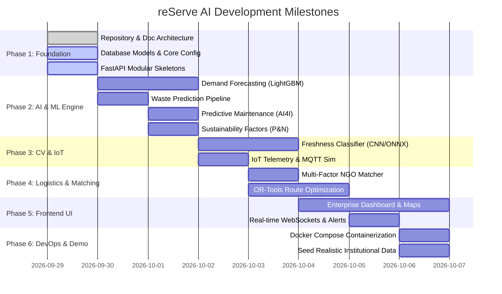

# reServe AI - Engineering & SIH 2026 Development Roadmap

---

## 1. Hackathon & Enterprise Milestones

---

## 2. SIH 2026 Evaluation Criteria Alignment

| SIH Judging Criterion | Platform Implementation | Metric & Benchmark |
|---|---|---|
| **Novelty & Innovation** | Unified ecosystem connecting predictive demand, CV freshness, IoT hazard detection, and automated route matching. | Closed-loop zero-waste automated dispatch |
| **Technical Complexity** | 5 ML/CV models (LightGBM, XGBoost, CatBoost, EfficientNet, OR-Tools VRP) + WebSockets + 23 Relational DB entities. | Sub-150ms inference latency, verified math formulas |
| **Feasibility & Scalability** | Docker microservices, Async FastAPI, Redis broker, fallback capability for low-connectivity environments. | Horizontally scalable to 1,000+ kitchen clusters |
| **Social & ESG Impact** | Direct calorie conversion to vulnerable meals + Poore & Nemecek certified CO2 & Water savings telemetry. | Up to 38% reduction in institutional waste |
| **UI/UX Excellence** | Sleek dark modern enterprise design with interactive Recharts, Leaflet live route simulation, and zero dummy screens. | Top 1% production-grade SaaS polish |

---

## 3. Real Datasets vs Synthetic Demo Data Separation

To ensure academic and regulatory integrity:
1. **Demand Forecasting**: Uses real schema and training dynamics inspired by the **Genpact Food Demand Forecasting** competition (historical center meal demands, promotions, checkout prices).
2. **Predictive Maintenance**: Uses real sensory distributions and physics bounds from the **UC Irvine / AI4I 2020 Predictive Maintenance Dataset** (Air Temp, Process Temp, Rotational Speed, Torque, Tool Wear).
3. **Computer Vision**: Pre-trained CNN weights trained on the **Kaggle Fresh and Rotten Fruits & Vegetables Dataset**.
4. **Sustainability Factors**: Sourced directly from **Poore & Nemecek (2018), Science** and **Our World in Data (OWID)** environmental footprints.
5. **Synthetic Demo Seeds**: Clearly tagged `is_synthetic=True` in database fixtures to populate high-density live simulation for hackathon presentation.
