# reServe AI - System Architecture Specification
## AI-Powered Smart Food Waste Reduction and Sustainable Redistribution Platform
**Smart India Hackathon (SIH 2026) Enterprise Edition**

---

## 1. Executive Summary

**reServe AI** is an enterprise-grade SaaS and operational intelligence platform designed for institutional kitchens (universities, corporate cafeterias, hospitals, military bases) and food processing units. It unifies predictive demand forecasting, computer vision-based freshness assessment, IoT environmental monitoring, automated NGO redistribution matching, dynamic vehicle route optimization, and ESG sustainability accounting into a single real-time decision ecosystem.

---

## 2. High-Level Architecture Diagram

```mermaid
flowchart TD
    subgraph DataSources["1. DATA SOURCES & INGESTION"]
        K1["Institutional POS / ERP"]
        K2["IoT Kitchen Sensors (Temp, Humidity, Gas, Energy)"]
        K3["Computer Vision Scanner (Freshness Cameras)"]
        K4["NGO Registry & Logistics Telemetry"]
    end

    subgraph Ingestion["2. INGESTION & BROKER LAYER"]
        MQTT["MQTT Broker (Eclipse Mosquitto / AWS IoT)"]
        REST["FastAPI Gateway / Async Webhooks"]
        WS["Real-Time WebSocket Server"]
        REDIS["Redis In-Memory Broker & Cache"]
    end

    subgraph Storage["3. STORAGE LAYER"]
        PG[("PostgreSQL Core DB + TimescaleDB")]
        S3[("Object Storage (S3 / MinIO for Images)")]
        AUDIT[("Immutable Audit & ESG Log Store")]
    end

    subgraph AIEngine["4. AI / ML INTELLIGENCE LAYER"]
        M1["Demand Forecasting (LightGBM/XGBoost on Genpact Data)"]
        M2["Waste Generation Predictor (Multi-feature ML)"]
        M3["CV Freshness & Shelf-Life Classifier (EfficientNet/MobileNet)"]
        M4["Predictive Maintenance Engine (AI4I 2020 CatBoost)"]
        M5["Sustainability Carbon & Water Engine (Poore & Nemecek)"]
    end

    subgraph Decision["5. DECISION & MATCHING ENGINE"]
        D1["Production Over/Under Adjustment Advisor"]
        D2["Surplus Redistribution Matcher (Distance, Shelf-life, Capacity)"]
        D3["Cold Chain & Storage Hazard Alerting Engine"]
    end

    subgraph Logistics["6. LOGISTICS OPTIMIZATION"]
        OR["OR-Tools VRP Vehicle Routing"]
        MAPS["OpenStreetMap / OSRM Navigation"]
        DISPATCH["Automated Dispatch & Driver Verification"]
    end

    subgraph Dashboards["7. MULTI-STAKEHOLDER DASHBOARDS"]
        DASH1["Executive & ESG Dashboard"]
        DASH2["Kitchen & Production Dashboard"]
        DASH3["Quality & Shelf-Life Dashboard"]
        DASH4["Redistribution & NGO Portal"]
        DASH5["Logistics & Fleet Tracking Map"]
        DASH6["Sustainability & ESG Compliance"]
    end

    DataSources --> Ingestion
    Ingestion --> Storage
    Storage --> AIEngine
    AIEngine --> Decision
    Decision --> Logistics
    Decision --> Dashboards
    Logistics --> Dashboards
```

---

## 3. End-to-End Data Flow

1. **Ingestion & Sensory Telemetry**:
   - Institutional kitchens generate hourly telemetry: meals planned vs consumed, temperature/humidity of dry and cold storage, raw material usage, and energy/water consumption.
   - Quality cameras take high-resolution food snapshots at receiving and prep stations, streaming to the CV processing service.

2. **AI Inference & Real-Time Decisioning**:
   - **Demand Forecasting**: Runs rolling 7-day, 24-hour, and meal-slot predictions factoring calendar events, historical meal patterns, weather, and center capacity.
   - **Computer Vision Freshness**: Food items undergo CNN feature extraction (EfficientNet-B0 backbone) to generate a Freshness Score (0–100%), estimated Remaining Shelf-life (days/hours), and suitability status (Immediate Redistribution, Secondary Processing, Composting).
   - **Storage Telemetry Anomaly Detection**: Temperature spikes in cold rooms trigger immediate alerts via WebSockets and SMS/Email before perishables degrade.

3. **Autonomous Surplus Redistribution**:
   - When predicted or recorded surplus occurs, the system initiates an automated auction/matching pipeline.
   - Nearby verified NGOs, food banks, and animal shelters are ranked by:
     - Distance and transit time
     - Storage capacity and dietary preferences
     - Shelf-life urgency vs delivery time
   - Logistics dispatch computes the optimal multi-stop vehicle route using Google OR-Tools and OpenStreetMap.

4. **Sustainability & ESG Audit Reporting**:
   - Every kilogram of rescued or diverted food is indexed against the **Poore & Nemecek (2018)** and **Our World in Data** lifecycle emissions factors.
   - Generates verified audit records for Scope 1, 2, and 3 GHG reduction, water footprint saved, and social impact metrics (meals delivered to vulnerable populations).

---

## 4. Technology Stack

| Layer | Primary Tech | Justification / Role |
|---|---|---|
| **Frontend UI** | React 18, TypeScript, Tailwind CSS, Framer Motion, Lucide Icons, Recharts | Ultra-responsive, dark-themed enterprise operations console |
| **Backend API** | FastAPI, Python 3.11+, Pydantic v2, WebSockets | Async non-blocking throughput, automatic OpenAPI documentation |
| **ORM & Database** | SQLAlchemy 2.0, Alembic, PostgreSQL 15 | Relational integrity, temporal time-series storage, audit logs |
| **Caching & Messaging** | Redis 7, Celery / Async Workers | In-memory pub/sub, sensor rate-limiting, background jobs |
| **Machine Learning** | LightGBM, XGBoost, Scikit-Learn, MLflow | Sub-second demand forecasting and predictive maintenance |
| **Computer Vision** | PyTorch, torchvision, ONNX Runtime, OpenCV | Edge-deployable real-time food freshness scoring |
| **Logistics Optimization** | Google OR-Tools, OSRM (Open Source Routing Machine) | Capacitated Vehicle Routing Problem with Time Windows (CVRPTW) |
| **DevOps & Cloud** | Docker, Docker Compose, Nginx, GitHub Actions | Zero-downtime microservices containerization |

---

## 5. Security, Tenancy, and Compliance

- **Authentication**: JWT bearer tokens with Argon2/bcrypt password hashing.
- **Role-Based Access Control (RBAC)**:
  - `SUPER_ADMIN`: Platform-wide governance and global analytics.
  - `ORG_ADMIN`: Organization and kitchen management, contract configuration.
  - `KITCHEN_MANAGER`: Daily meal planning, inventory batches, and waste reporting.
  - `QUALITY_INSPECTOR`: Image scanning, shelf-life verification, and hazard alerts.
  - `LOGISTICS_COORDINATOR`: Vehicle fleet dispatch, pickup routing, and delivery verification.
  - `NGO_REPRESENTATIVE`: Surplus claim, acceptance, and beneficiary acknowledgment.
- **Audit Logs**: Every status change, redistribution match, and disposal log is tamper-proofed with timestamp, actor ID, and IP address for ESG compliance verification.
